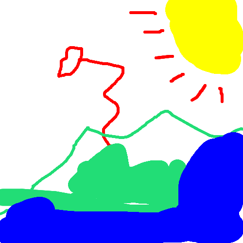

# Kenmil Simple Draw Version 1.0.0

## https://kennyneedsmilky.github.io/kenmil-simple-draw/

#

## Example Pictures

 

 

Interested? Try the live demo [here](https://kennyneedsmilky.github.io/kenmil-simple-draw/)!

#

## About this App

This is an app that is made by Kenneth and Miyuki Fullbright.

## -- Features --

### ☆ Undo

If you don't like what you did, you can click the undo button and try again.

### ☆ Delete

If you want to clear the entire canvas, you can click the delete button.

### ☆ Pick Color

There are many way to pick colors in this app. You can either choose an already defined color or choose from the color picker.

### ☆ Save

If you want to osave your picture, just ckick the save button that is at the bottom right of the app. It will automatically save the image with a unique filename.

## -- Current Problems (Please help if you have any solutions). --

### Problem 1

We understand that there may be problems using this app in mobile mode on certain mobile browsers. This problem mainly happens becaause of the field that allows people to type in url to other websites (that isn't part of the app). We care currently looking into solutions that can fix this problem.

### Problem 2

There may be small UI bugs depending on the size of the window of the browser. This mainly happens when the web app is in mobile landscape mode. We are currently looking into ways to solve this issue and there may be a fix in a future major update.
